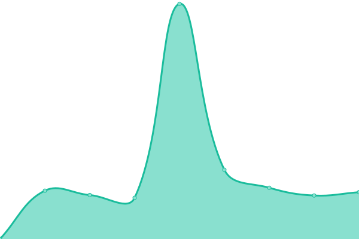

# [📈 Live Status](https://restuillahi.github.io/uptime): <!--live status--> **🟧 Partial outage**

This repository contains the open-source uptime monitor and status page for [restuillahi](https://restuillahi.github.io/uptime), powered by [Upptime](https://github.com/upptime/upptime).

With [Upptime](https://upptime.js.org), you can get your own unlimited and free uptime monitor and status page, powered entirely by a GitHub repository. We use [Issues](https://github.com/restuillahi/uptime/issues) as incident reports, [Actions](https://github.com/restuillahi/uptime/actions) as uptime monitors, and [Pages](https://restuillahi.github.io/uptime) for the status page.

<!--start: status pages-->
<!-- This summary is generated by Upptime (https://github.com/upptime/upptime) -->
<!-- Do not edit this manually, your changes will be overwritten -->
<!-- prettier-ignore -->
| URL | Status | History | Response Time | Uptime |
| --- | ------ | ------- | ------------- | ------ |
|  DNS Primary | 🟩 Up | [dns-primary.yml](https://github.com/restuillahi/uptime/commits/HEAD/history/dns-primary.yml) | 

 214ms
     
 | 

<a href="https://restuillahi.github.io/uptime/history/dns-primary">100.00%</a>
    

|  Website | 🟥 Down | [website.yml](https://github.com/restuillahi/uptime/commits/HEAD/history/website.yml) | 

 231ms
     
 | 

<a href="https://restuillahi.github.io/uptime/history/website">0.00%</a>
    

|  Cloud Storage | 🟩 Up | [cloud-storage.yml](https://github.com/restuillahi/uptime/commits/HEAD/history/cloud-storage.yml) | 

 2526ms
     
 | 

<a href="https://restuillahi.github.io/uptime/history/cloud-storage">75.78%</a>
    

|  VPN | 🟩 Up | [vpn.yml](https://github.com/restuillahi/uptime/commits/HEAD/history/vpn.yml) | 

 1021ms
     
 | 

<a href="https://restuillahi.github.io/uptime/history/vpn">100.00%</a>
    

|  VPN Primary | 🟩 Up | [vpn-primary.yml](https://github.com/restuillahi/uptime/commits/HEAD/history/vpn-primary.yml) | 

 212ms
     
 | 

<a href="https://restuillahi.github.io/uptime/history/vpn-primary">100.00%</a>
    

|  VPN Secondary | 🟩 Up | [vpn-secondary.yml](https://github.com/restuillahi/uptime/commits/HEAD/history/vpn-secondary.yml) | 

 212ms
     
 | 

<a href="https://restuillahi.github.io/uptime/history/vpn-secondary">100.00%</a>
    

<!--end: status pages-->

[**Visit our status website →**](https://restuillahi.github.io/uptime)

## 📄 License

- Powered by: [Upptime](https://github.com/upptime/upptime)
- Code: [MIT](./LICENSE) © [Anand Chowdhary](https://anandchowdhary.com), supported by [Pabio](https://pabio.com)
- Data in the `./history` directory: [Open Database License](https://opendatacommons.org/licenses/odbl/1-0/)
